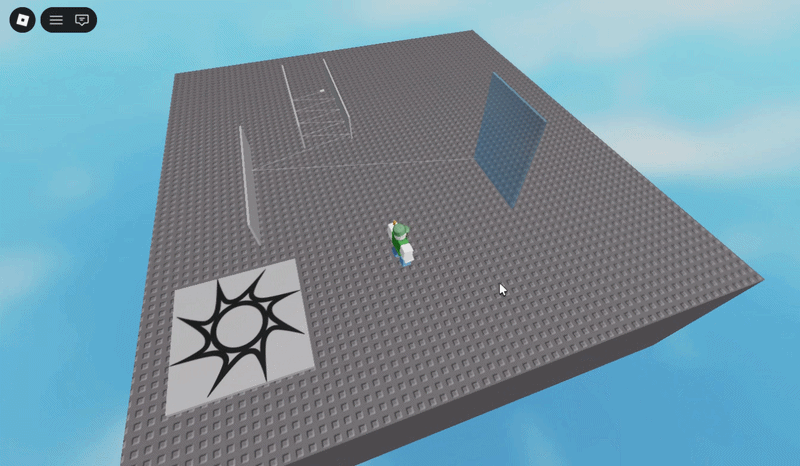

# Predictive Bullet Path

Predicts and visualizes bullet ricochet paths using raycasting, with glass-shattering on impact.

## Features
* **Path Prediction:** Simulates bullet trajectory ahead of time using raycasting and reflection off surfaces.
* **Real-Time Visualization:** Renders the predicted path and animates the bullet flying along it, segment by segment.
* **Glass Shattering:** Breaks glass surfaces into pieces on impact.

## Installation
1. Download `Bullet.luau` from this repository.
2. Place it inside your bullet model, alongside `BulStart` and `BulEnd` attachments.
3. Open `Place.rbxl` to see a working example setup.

## Requirements
The script expects two `Attachment` instances as siblings:
* `BulStart` — where the bullet starts.
* `BulEnd` — where the bullet ends (fired direction).